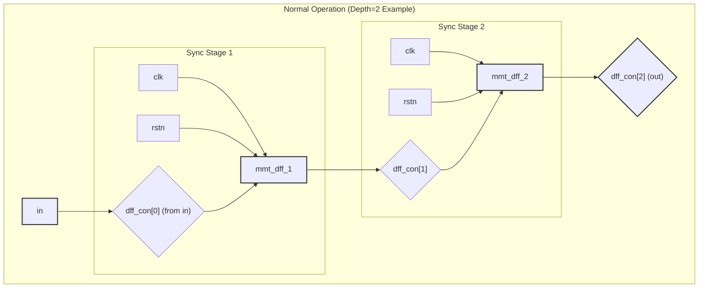
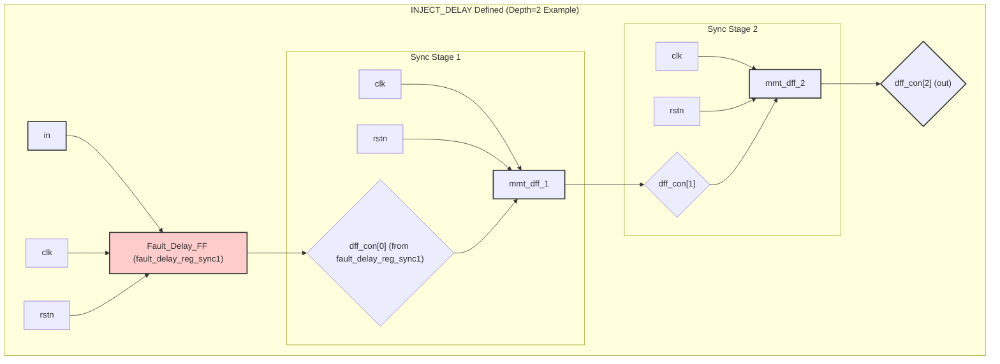
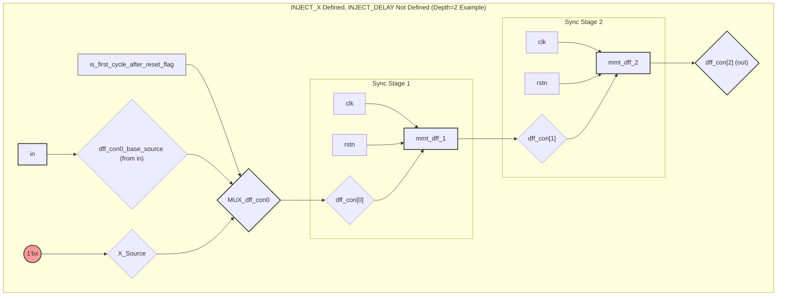
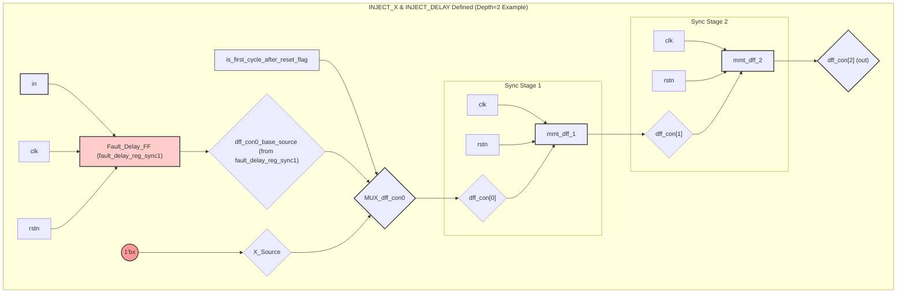
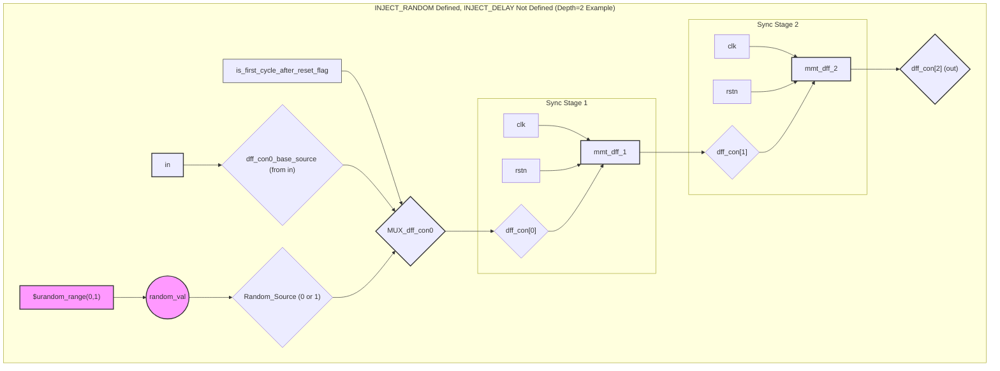
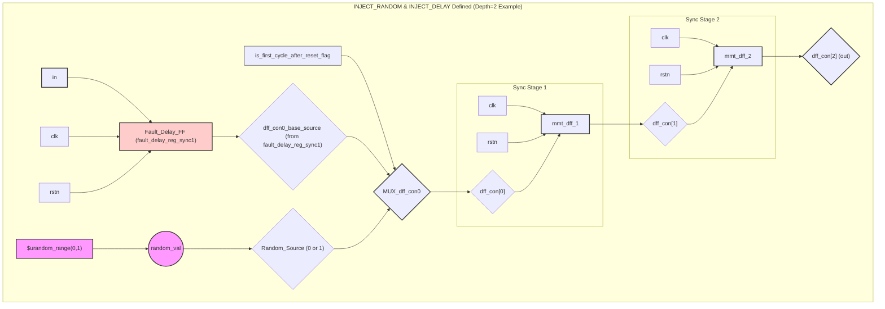

# mmt_sync_single.v 电路示意图 (Mermaid)

本文档包含 `mmt_sync_single.v` 模块在不同宏控制下的行为的 Mermaid 图描述。
您可以将这些代码块复制到支持 Mermaid 的 Markdown 编辑器或在线工具中查看可视化图表。
这些图以 `Depth=2`（即两级主同步触发器）为例进行说明。

## 1. 正常操作 (未定义 `INJECT_X` 或 `INJECT_DELAY`)

**描述**:
*   输入信号 `in` 直接连接到同步链的第一个D触发器 (`mmt_dff_1`) 的输入 `dff_con[0]`。
*   信号通过两级 `mmt_dff` 触发器进行同步。
*   最终输出 `out` 来自第二级触发器的输出 `dff_con[2]`。

## 2. 定义 `INJECT_DELAY` (注入一级延迟)

**描述**:
*   输入信号 `in` 首先进入一个额外的触发器 `fault_delay_reg_sync1`。
*   `fault_delay_reg_sync1` 的输出 (`dff_con0_base_source`) 作为 `dff_con[0]` 连接到同步链的第一个D触发器。
*   这有效地在主同步路径之前增加了一级延迟。

## 3. 定义 `INJECT_X` (注入 'X', `INJECT_DELAY` 未定义)

**描述**:
*   `dff_con[0]` 的值由一个概念上的多路选择器 (MUX) 决定，该选择器由 `is_first_cycle_after_reset_flag` 控制。
*   当 `is_first_cycle_after_reset_flag` 为真（即解复位后的第一个有效时钟周期）且 `rstn` 为高时，`dff_con[0]` 被强制为 `1'bx`。
*   在其他情况下，`dff_con[0]` 的值来自 `dff_con0_base_source`，这里因为 `INJECT_DELAY` 未定义，所以 `dff_con0_base_source` 直接是 `in`。
*   这个 `1'bx` 会被同步链的第一级触发器捕获。

## 4. 定义 `INJECT_X` 和 `INJECT_DELAY` (同时注入延迟和 'X')

**描述**:
*   输入信号 `in` 首先进入 `fault_delay_reg_sync1`。
*   `fault_delay_reg_sync1` 的输出作为 `dff_con0_base_source`。
*   `dff_con[0]` 的值由一个概念上的多路选择器 (MUX) 决定，该选择器由 `is_first_cycle_after_reset_flag` 控制。
*   当 `is_first_cycle_after_reset_flag` 为真且 `rstn` 为高时，`dff_con[0]` 被强制为 `1'bx`。
*   在其他情况下，`dff_con[0]` 的值来自 `dff_con0_base_source` (即 `fault_delay_reg_sync1` 的输出)。
*   这个 `1'bx` (如果被选中) 会被同步链的第一级触发器捕获。

## 5. 定义 `INJECT_RANDOM` (注入随机0/1, `INJECT_DELAY` 未定义)

**描述**:
*   `dff_con[0]` 的值由一个概念上的多路选择器 (MUX) 决定，该选择器由 `is_first_cycle_after_reset_flag` 控制。
*   当 `is_first_cycle_after_reset_flag` 为真（即解复位后的第一个有效时钟周期）且 `rstn` 为高时，`dff_con[0]` 被强制为一个随机的0或1 (来自 `$urandom_range(0,1)` 生成的 `random_val`)。
*   在其他情况下，`dff_con[0]` 的值来自 `dff_con0_base_source`，这里因为 `INJECT_DELAY` 未定义，所以 `dff_con0_base_source` 直接是 `in`。
*   这个随机值会被同步链的第一级触发器捕获。

## 6. 定义 `INJECT_RANDOM` 和 `INJECT_DELAY` (同时注入延迟和随机0/1)

**描述**:
*   输入信号 `in` 首先进入 `fault_delay_reg_sync1`。
*   `fault_delay_reg_sync1` 的输出作为 `dff_con0_base_source`。
*   `dff_con[0]` 的值由一个概念上的多路选择器 (MUX) 决定，该选择器由 `is_first_cycle_after_reset_flag` 控制。
*   当 `is_first_cycle_after_reset_flag` 为真且 `rstn` 为高时，`dff_con[0]` 被强制为一个随机的0或1 (来自 `$urandom_range(0,1)` 生成的 `random_val`)。
*   在其他情况下，`dff_con[0]` 的值来自 `dff_con0_base_source` (即 `fault_delay_reg_sync1` 的输出)。
*   这个随机值 (如果被选中) 会被同步链的第一级触发器捕获。
