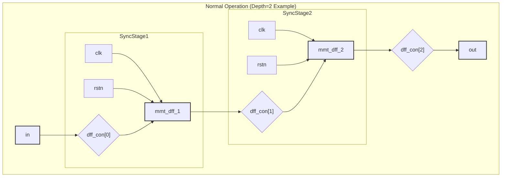
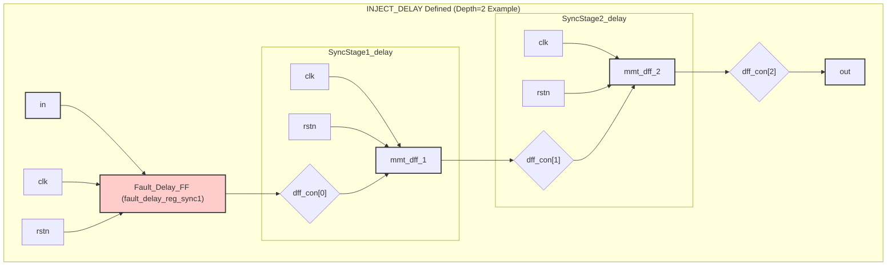

# mmt_sync_single.v 电路示意图 (Mermaid)

本文档包含 `mmt_sync_single.v` 模块在不同宏控制下的行为的 Mermaid 图描述。
您可以将这些代码块复制到支持 Mermaid 的 Markdown 编辑器或在线工具中查看可视化图表。
这些图以 `Depth=2`（即两级主同步触发器）为例进行说明。

## 1. 正常操作 (未定义 `INJECT_X` 或 `INJECT_DELAY`)



## 2. 定义 `INJECT_DELAY` (注入一级延迟)



## 3. 定义 `INJECT_X` (注入 'X')

```mermaid
%% 3. 定义 INJECT_X (注入 'X')
graph TD;
    subgraph mmt_sync_single_x ["INJECT_X Defined (Depth=2 Example)"]
        direction LR;
        
        IN_x[in];
        %% Input 'in' is present but not connected to the sync chain directly
        X_Source((1'bx)) --> DFF1_IN_x{"dff_con[0]"};
        
        subgraph SyncStage1_x
            direction LR;
            CLK1_x[clk] --> DFF1_x[mmt_dff_1];
            RSTN1_x[rstn] --> DFF1_x;
            DFF1_IN_x --> DFF1_x;
        end
        DFF1_x --> DFF1_OUT_x{"dff_con[1]"};
        
        subgraph SyncStage2_x
            direction LR;
            CLK2_x[clk] --> DFF2_x[mmt_dff_2];
            RSTN2_x[rstn] --> DFF2_x;
            DFF1_OUT_x --> DFF2_x;
        end
        DFF2_x --> DFF2_OUT_x{"dff_con[2]"};
        
        DFF2_OUT_x --> OUT_x[out];

        style IN_x fill:#lightgreen,stroke:#333,stroke-width:2px
        style X_Source fill:#ff9999,stroke:#333,stroke-width:2px
        style OUT_x fill:#lightblue,stroke:#333,stroke-width:2px
        style DFF1_x fill:#orange,stroke:#333,stroke-width:2px
        style DFF2_x fill:#orange,stroke:#333,stroke-width:2px
    end
